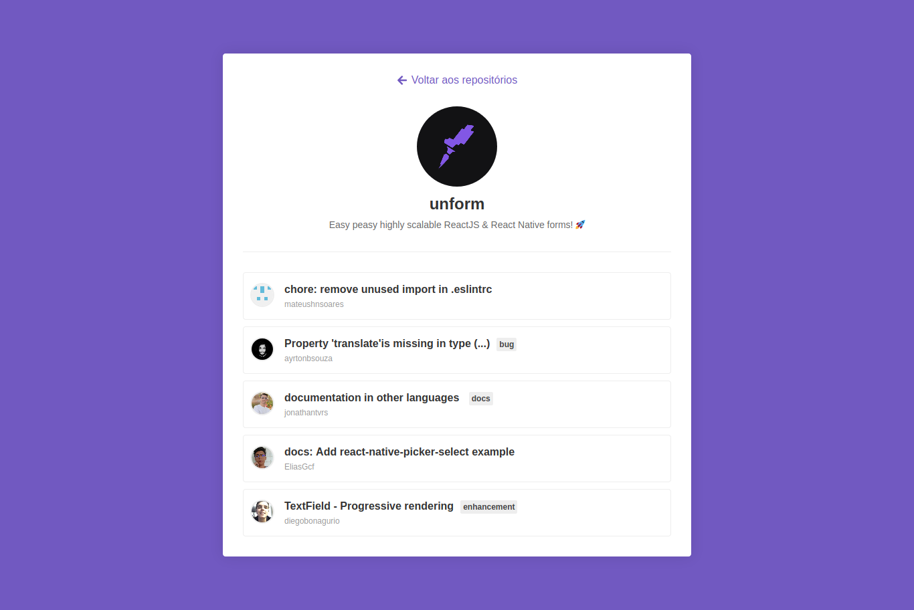

# github-repository-finder

## Project

***EN:*** This project is a react application developed during Rocketseat's GoStack Bootcamp that makes requests to the github API with the functionality of finding repositories, formulating useful information to the user in a clean interface. We managed to get data like the name of the repository, official link, issues, etc.

***PT-BR:*** Este projeto é um aplicação react desenvolvida durante o Bootcamp GoStack da Rocketseat que faz solicitações à API do github com a funcionalidade de encontrar repositórios, formulando informações úteis para o usuário em uma interface limpa. Conseguimos obter dados como o nome do repositório, link oficial, issues, etc.

## Technologies

This project was developed with the following technologies:

- HTML
- CSS
- ReactJS
- Styled Components
- Axios
***

## Preview

***

## How To Install

Clone the project and then in the project directory, run:

### `npm install or yarn`
#### Install project with all dependencies.    

And finally run the command in the project directory

### `npm run start or yarn start`
#### Runs the React App on port 3000.    
